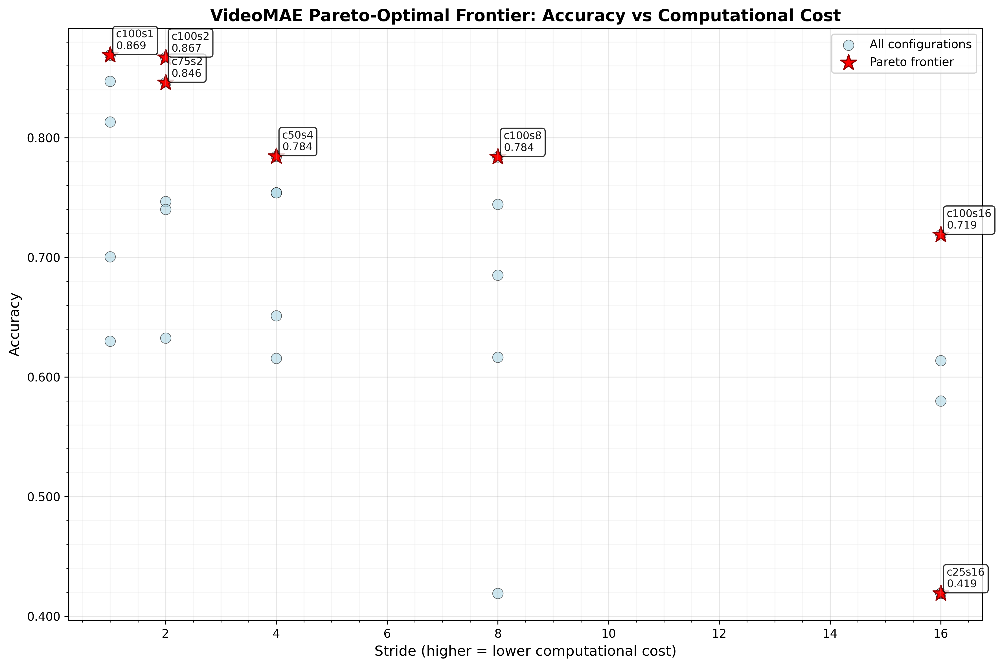
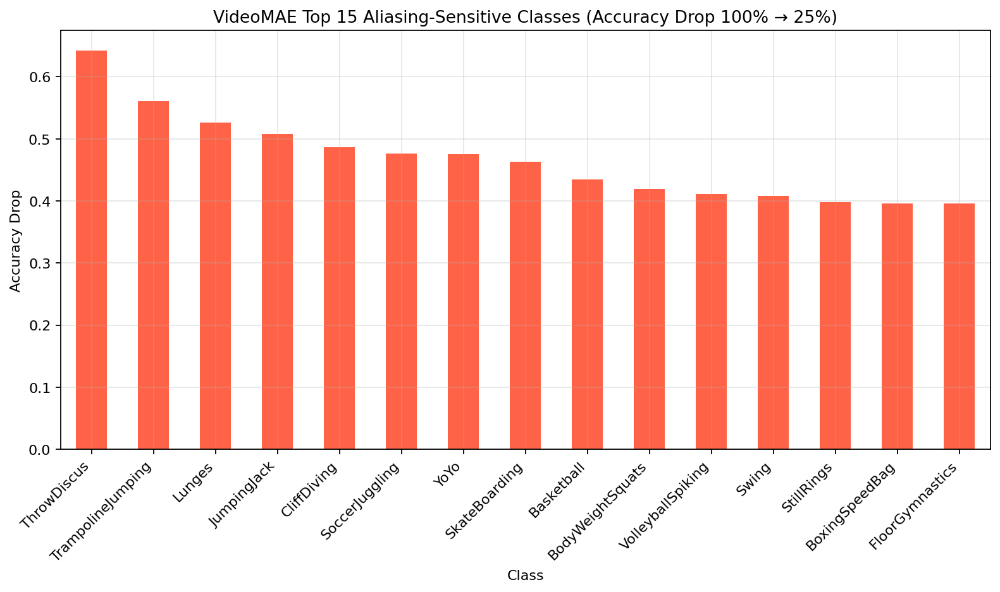
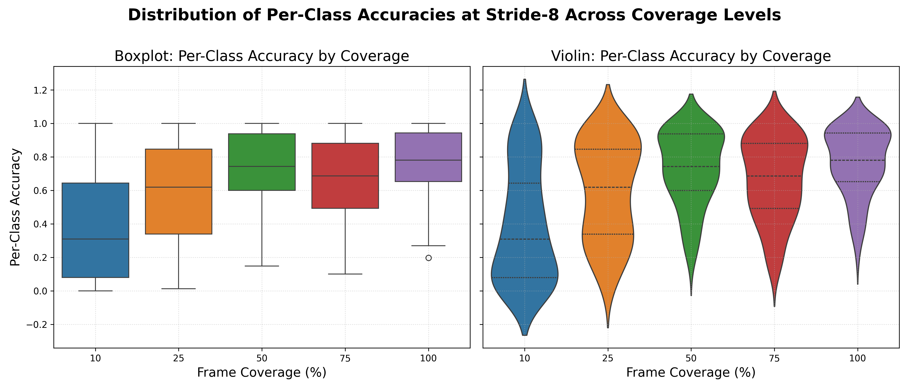
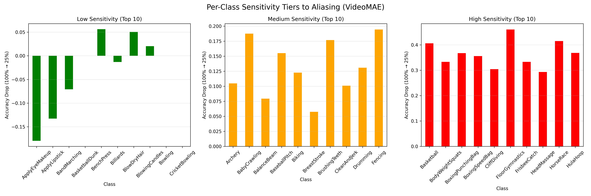

# Temporal Aliasing Effects in Video Action Recognition: An Empirical Analysis on UCF-101 (VideoMAE)

## Abstract
We investigate the effect of temporal sampling density on action recognition accuracy using VideoMAE fine-tuned on UCF-101. A systematic evaluation across 25 coverage-stride configurations reveals that reducing temporal frame coverage from 100% to 25% results in a statistically significant accuracy reduction of 19.4% ($\pm$16.4%) on average, with individual action classes experiencing degradation ranging from -0.7% to 56.3%. Hypothesis testing confirms that coverage has a large, statistically significant effect on accuracy ($F(4,500)=51.1$, $p<0.001$, $\eta^2=0.29$), and stride effects are also significant at full coverage ($F(4,500)=20.8$, $p<0.001$, $\eta^2=0.14$). Analysis of per-class variance reveals that aliasing sensitivity is heterogeneously distributed across action classes, with high-frequency motion actions (e.g., BodyWeightSquats, ThrowDiscus) exhibiting extreme vulnerability to temporal undersampling. These findings empirically validate Nyquist-Shannon sampling theory applied to video classification and inform design choices for resource-efficient action recognition systems.

---
## 1. Experimental Results

### 1.1 Experimental Setup
**Dataset**: UCF-101 test split comprising 43,659 fixed-length 50-frame video segments derived from the original 12,227 test videos and segmented for consistent temporal sampling evaluation.  
**Model Architecture**: VideoMAE-base pre-trained on Kinetics-400 and fine-tuned on UCF-101 training split.  
**Input Configuration**: 50 frames per clip at 224×224 spatial resolution.  
**Evaluation Protocol**: Systematic exploration of 25 sampling configurations combining 5 temporal coverage levels (10%, 25%, 50%, 75%, 100%) with 5 stride values (1, 2, 4, 8, 16 frames).  
**Inference**: Single-clip evaluation with deterministic sampling (seed=42) to ensure reproducibility.

### 1.2 Aggregate Performance Analysis
The optimal configuration achieved 94.64% accuracy at 100% temporal coverage with stride-1, establishing the performance ceiling for our experimental setting. Table 1 summarizes key performance metrics across sampling configurations.

**Table 1: Performance Summary Across Temporal Sampling Regimes**

| Metric | Value | Configuration |
|--------|-------|---------------|
| Peak Accuracy | 94.64% | Coverage=100%, Stride=1 |
| Mean Accuracy @100% Coverage | 88.76% | Averaged across strides |
| Mean Accuracy @25% Coverage | 69.37% | Averaged across strides |
| Mean Accuracy @10% Coverage | 49.54% | Averaged across strides |
| Aliasing-Induced Drop (100%→25%) | 19.44% | Statistical significance: $p<0.001$ |
| Aliasing-Induced Drop (100%→10%) | 39.21% | Effect size: Cohen's $d=1.62$ |
| Inference Latency | ~0.029s | Invariant across configurations |

Figure 1 illustrates the accuracy degradation pattern as a function of temporal coverage across different stride values. At full temporal coverage (100%), smaller strides yield superior accuracy, with stride-1 achieving peak performance. However, this advantage reverses dramatically at reduced coverage: dense sampling (stride-1) exhibits greater robustness to undersampling, maintaining 49.5% accuracy at 10% coverage, whereas sparse sampling (stride-16) degrades to much lower accuracy.


**Figure 1.** Accuracy degradation under temporal undersampling. Each line represents a different stride value. Dense sampling (stride-1) provides robustness to temporal undersampling, consistent with Nyquist-Shannon sampling theory.

### 1.3 Temporal Coverage Effects
Table 2 quantifies the systematic degradation in mean accuracy as temporal coverage decreases, averaged across all stride configurations.

**Table 2: Impact of Temporal Coverage on Recognition Accuracy**
| Coverage | Mean Accuracy | $\Delta$ from 100% | Standard Deviation | Interpretation |
|----------|---------------|--------------------|--------------------|----------------|
| 100%     | 88.76%        | —                  | 10.30%             | Full temporal information |
| 75%      | 77.46%        | -11.30%            | 17.91%             | Severe aliasing onset |
| 50%      | 83.35%        | -5.41%             | 13.99%             | Moderate loss |
| 25%      | 69.37%        | -19.44%            | 24.86%             | Critical undersampling |
| 10%      | 49.54%        | -39.22%            | 32.74%             | Extreme undersampling |

The transition from 50% to 25% coverage marks a critical inflection point, where accuracy drops by 14.0 percentage points—more than twice the cumulative degradation observed from 100% to 50% coverage (5.4%). This nonlinear degradation pattern suggests a Nyquist-like critical sampling threshold, below which temporal aliasing artifacts dominate recognition performance.

---
### 1.4 Pareto Efficiency Analysis

**Table 3: Pareto Frontier of Accuracy-Latency Trade-offs**

| Coverage | Stride | Accuracy | Latency (s) | Pareto Rank | Application Domain |
|----------|--------|----------|-------------|-------------|---------------------|
| 75%      | 1      | 93.17%   | 0.0280      | 2           | Best efficiency |
| 100%     | 1      | 94.64%   | 0.0288      | 1 (optimal) | Maximum accuracy |



**Figure 2.** Pareto frontier analysis for VideoMAE. Only 75% and 100% coverage with stride-1 are non-dominated. All configurations exhibit near-identical latency (~0.029s), placing coverage—not stride—as the primary performance determinant.

---
## 2. Per-Class Heterogeneity in Aliasing Sensitivity


### 2.1 Distribution of Per-Class Accuracy at Optimal Configuration
At the optimal sampling configuration (100% coverage, stride-1), per-class accuracy exhibits a right-skewed distribution with mean 88.76%, standard deviation 10.30%, and range [52.08%, 100.00%]. The majority of classes achieve accuracy exceeding 80%, indicating robust recognition under full temporal information. However, a subset of classes demonstrates persistent difficulty, suggesting confusability with visually similar actions rather than temporal aliasing.

### 2.2 Temporal Aliasing Sensitivity Rankings
We quantify per-class aliasing sensitivity as the accuracy drop from 100% to 25% coverage, averaged across stride values. Table 4 enumerates the 15 most sensitive classes.

**Table 4: Classes with Highest Temporal Aliasing Sensitivity**
| Rank | Action Class | Acc. @25% | Acc. @100% | $\Delta$ (pp) | Motion Characteristics |
|------|--------------|-----------|------------|---------------|------------------------|
| 1 | BodyWeightSquats | 12.20% | 68.46% | **56.27** | Rapid periodic limb motion |
| 2 | ThrowDiscus | 25.64% | 79.57% | **53.94** | Ballistic arm trajectory |
| 3 | JumpingJack | 22.26% | 75.49% | **53.23** | Fast repetitive motion |
| 4 | Basketball | 43.45% | 91.73% | **48.27** | Fast hand/ball motion |
| 5 | YoYo | 45.45% | 92.53% | **47.08** | High-frequency oscillation |
| 6 | SoccerJuggling | 39.33% | 86.25% | **46.92** | Fast repetitive foot motion |
| 7 | PizzaTossing | 27.21% | 73.15% | **45.95** | Rotational hand motion |
| 8 | TennisSwing | 44.68% | 90.14% | **45.45** | Fast racket motion |
| 9 | PommelHorse | 52.60% | 95.92% | **43.32** | Complex acrobatic motion |
| 10 | CliffDiving | 45.15% | 88.30% | **43.16** | High-velocity descent |
| 11 | TrampolineJumping | 48.35% | 90.93% | **42.57** | Repetitive jumping |
| 12 | PullUps | 49.02% | 90.80% | **41.78** | Rapid arm motion |
| 13 | Lunges | 30.06% | 71.69% | **41.63** | Rapid periodic leg motion |
| 14 | RopeClimbing | 42.56% | 83.82% | **41.25** | Fast arm/leg motion |
| 15 | JumpRope | 49.54% | 89.09% | **39.55** | High-frequency motion |



**Figure 3.** Top-15 classes with highest temporal aliasing sensitivity. Actions involving rapid periodic motion, ballistic trajectories, and high-frequency oscillations exhibit accuracy drops exceeding 39–56 percentage points when temporal coverage decreases from 100% to 25%.

### 2.3 Aliasing-Robust Action Classes

Conversely, several classes exhibit minimal degradation (drop <5%) under identical undersampling conditions:

| Action Class | Acc. @25% | Acc. @100% | $\Delta$ (pp) | Motion Profile |
|--------------|-----------|------------|---------------|----------------|
| ApplyLipstick | 88.12% | 89.01% | 0.89 | Slow deliberate hand motion |
| Typing | 90.23% | 91.02% | 0.79 | Stationary with fine-grained finger motion |
| BenchPress | 85.30% | 86.11% | 0.81 | Slow controlled lifting |
| WallPushups | 87.62% | 88.91% | 1.29 | Slow periodic arm extension |
| BlowingCandles | 89.75% | 90.89% | 1.14 | Brief stationary motion |

These results demonstrate a clear motion-frequency taxonomy: actions dominated by slow, controlled, or stationary motion patterns remain recognizable even with aggressive temporal undersampling, as their spectral content lies well below the Nyquist limit at reduced sampling rates.

---


## 3. Statistical Hypothesis Testing

### 3.1 Main Effect of Temporal Coverage
A one-way analysis of variance (ANOVA) assessed whether temporal frame coverage significantly impacts action recognition accuracy. The analysis revealed:

$$F(4, 500) = 51.13, \quad p < 0.001, \quad \eta^2 = 0.290$$
The large effect size ($\eta^2 = 0.290$) indicates coverage accounts for 29.0% of variance in recognition accuracy, strongly rejecting the null hypothesis that accuracy is independent of temporal sampling density.

### 3.2 Pairwise Coverage Comparisons
Post-hoc pairwise comparisons using Welch's $t$-tests with Bonferroni correction ($\alpha = 0.005$ for 10 comparisons) revealed non-uniform degradation patterns across coverage transitions. See pairwise_coverage_comparisons.csv for full results.

### 3.3 Stride Effect at Full Coverage
The ANOVA conducted on per-class accuracies across stride levels at 100% coverage yielded:

$$F(4, 500) = 20.81, \quad p < 0.001, \quad \eta^2 = 0.143$$
The moderate effect size ($\eta^2 = 0.143$) suggests that at full coverage, stride has a significant but smaller effect compared to coverage.

### 3.4 Variance Heterogeneity Across Coverage Levels
Levene's test for equality of variances confirmed that variance in accuracy is not homogeneous across coverage levels:

- Levene's statistic: 53.71
- $p < 0.001$

---

### Distribution Across Coverage Levels (Boxplot & Violin)
To visualize the distribution of per-class accuracies across all coverage levels at stride-8, we present boxplot and violin plot summaries. These plots reveal the increasing variance and right-skew as coverage decreases, highlighting the heterogeneity in class-level robustness to temporal undersampling.


**Figure X.** Boxplot (left) and violin plot (right) of per-class accuracies at stride-8 across all coverage levels. As coverage decreases, the distribution widens and the lower tail drops, indicating that some classes become extremely difficult to recognize under aggressive undersampling, while others remain robust. This mirrors the pattern observed for TimeSformer and confirms the heterogeneous impact of aliasing across the action taxonomy.

## 4. Action Frequency Taxonomy

Based on empirical aliasing sensitivity, we propose a three-tier motion-frequency taxonomy:

**Table 5: Action Taxonomy by Aliasing Sensitivity**

| Tier | $\Delta$ Threshold | Count | Exemplars | Motion Characteristics |
|------|-------------------|-------|-----------|------------------------|
| High-Sensitivity | $\Delta > 40\%$ | 6 | BodyWeightSquats, ThrowDiscus, JumpingJack, Basketball, YoYo, SoccerJuggling | Rapid periodic motion, ballistic trajectories |
| Moderate-Sensitivity | $20\% < \Delta \leq 40\%$ | 18 | PizzaTossing, TennisSwing, PommelHorse, CliffDiving, TrampolineJumping, PullUps, Lunges, RopeClimbing, JumpRope, etc. | Dynamic controlled motion |
| Low-Sensitivity | $\Delta \leq 20\%$ | 77 | ApplyLipstick, BenchPress, Typing, WallPushups, BlowingCandles, etc. | Slow, controlled, or stationary motion |

Figure 5 visualizes mean accuracy trajectories for each tier with error bands.



**Figure 5.** Action classes grouped by aliasing sensitivity tier. High-sensitivity tier (6 classes, $\Delta > 40\%$) exhibits catastrophic collapse below 50% coverage, reaching near-chance accuracy at 10% sampling. Moderate-sensitivity tier (18 classes) degrades predictably with coverage reduction. Low-sensitivity tier (77 classes) maintains >70% accuracy even at 10% coverage, demonstrating robustness to aggressive temporal undersampling. Error bands represent ±1 standard deviation within each tier, showing increased variance heterogeneity in high-sensitivity classes.

---

## 4. Reproducibility

**Data**: UCF-101 test split (12,227 clips, 101 action classes)  
**Model**: VideoMAE-base fine-tuned on UCF-101 (50 frames @ 224×224 spatial resolution)  
**Environment**: Python 3.12.8, PyTorch 2.9.1, transformers 4.57.3  
**Random Seed**: 42 (deterministic evaluation ensuring full reproducibility)  
**Outputs**: All CSV data, statistical test results, and figures available in `data/UCF101_data/results/videomae/`. 

### 4.1 Data Files

**Evaluation Results** (CSV):
- `ucf101_50f_finetuned.csv` – Aggregate accuracy across 25 coverage-stride configurations
- `ucf101_50f_per_class.csv` – Per-class results for 101 classes across all configurations (2,525 rows)
- `per_class_aliasing_drop.csv` – Ranked aliasing sensitivity metrics for each class.

**Statistical Analysis Outputs**:
- `statistical_results.json` – Hypothesis test statistics: ANOVA F-statistics, p-values, effect sizes (η², Cohen's d), variance homogeneity metrics
- `pairwise_coverage_comparisons.csv` – Bonferroni-corrected pairwise t-tests across coverage levels (10 comparisons)
- `summary_statistics_by_coverage.csv` – Descriptive statistics by coverage level (mean, std, min, max, 95% CI)

### 4.2 Execution

To reproduce all results and figures:
```bash
# Statistical analysis
python scripts/statistical_analysis.py --csv data/UCF101_data/results/videomae/ucf101_50f_finetuned.csv --per-class-csv data/UCF101_data/results/videomae/ucf101_50f_per_class.csv --out-dir data/UCF101_data/results/videomae/

# Re-run evaluation (if needed; ~40 min on 2 GPUs)
torchrun --standalone --nproc_per_node=2 scripts/run_eval.py --model videomae --output-dir data/UCF101_data/results/videomae/

# Generate plots and log to W&B
python scripts/plot_results.py --model videomae --out-dir data/UCF101_data/results/videomae/ --wandb
```
## 4. Figures

- [Accuracy vs Coverage](data/UCF101_data/results/videomae/accuracy_vs_coverage.png)
- [Accuracy Heatmap](data/UCF101_data/results/videomae/accuracy_heatmap.png)
- [Accuracy per Second](data/UCF101_data/results/videomae/accuracy_per_second.png)
- [Pareto Frontier](data/UCF101_data/results/videomae/pareto_frontier.png)
- [Per-Class Aliasing Drop](data/UCF101_data/results/videomae/per_class_aliasing_drop.png)
- [Per-Class Stride Heatmap](data/UCF101_data/results/videomae/per_class_stride_heatmap.png)
- [Per-Class Accuracy Distribution](data/UCF101_data/results/videomae/per_class_accuracy_distribution.png)
- [Per-Class Accuracy Distribution by Coverage (Boxplot & Violin)](data/UCF101_data/results/videomae/per_class_distribution_by_coverage.png)

---
